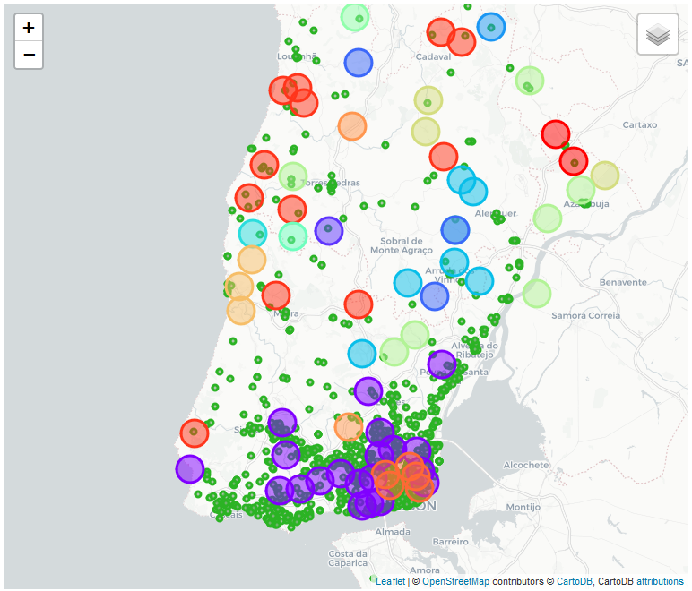

# **Location Scouting for new Lottery POS - Report**
by [Hugo Bertini](https://github.com/hbertini-ds) @ 2020.07   
###### _*POS: Point Of Sales_

## **Introduction**

### The Goal - Find adequate locations for new Lottery POSes   

This is one way of assisting the Lottery in the decision of selecting a new location or of assessing whether a proposal for a new POS is suitable.   

### Who is this for     
This study is aimed for Lottery's Commercial Network Managers and other Lottery Business Teams.   

### Background   

The Lottery business strongly relies on the proximity with their audience. And this proximity happens at many different levels and manners, especially because it is usually an activity operated by a minimal number of public entities/companies, and is significantly controlled by Governments.   

The outcome of this activity will typically bring benefit social causes which in turn take care of those in need.   

As such, it is important for the Lottery operators and the Society to ensure that although the level of commercial activity is kept in good health, the responsible gaming criteria is also met.   

### Approach   

In this _paper_ we study a number of information sources with the hope of establishing a reasonable set of criteria that would increase the odds of the Lottery activity growing within the responsible gaming figure.   

The main aspect that will be in focus herein is the location of a new POS. 

Social levels/tiers of each area are not considered in this study, as this information is rather hard to gather as a freelance investigator.    
So we will rather give higher consideration for areas where the commercial activity is greater and are less saturated with other POSes.   

____    

## **The Data**

### **Data Sources**

For this study I will use the following data source types: geo-administrative divisions, geo-location, Foursquare and Existing POS.   

More specifically, those are:   
1. **Neighbourhoods, boroughs and districts** of Portugal
    - This will provide a complete list of geographic administrative divisions, that will be used for selecting the focus of the study.
1. **geoJSON vector maps** of Portugal
    - This information allows knowing the shape of boroughs, which will become useful for certain over-the-map representation of the data.
1. **Foursquare venue** information
    - This will allow knowing what kinds of venues are on each street and their coordinates.
1. **Existing Lottery POS location** information from a provider's website
    - This is to know the streets where there currently are POSes available for the studied district.

### **Data Handling**

Each one of these data sources is available in a different way, so I will use 4 approaches:   

1. **Neighbourhoods, boroughs and districts** of Portugal
   - This information will be extracted from a xslx file, and then used in a Pandas DataFrame.
1. **geoJSON vector maps** of Portugal   
   - I will use a geoJSON shapes file representing the Districts and boroughs of Portugal.   
1. **Foursquare venue** information   
   - The information about venues will be grabbed from the Foursquare API. 
   - The information of interest is about trends, likes, categories, similarity and details.
1. **Existing Lottery POS** information in Portugal from the provider's website
   - I will perform a manual scraping on the publicly available webpage of [SCML](https://www.djogos.scml.pt/web/SCMediador/verMediadores) for the intended District. I decided on a semi-automated approach as it is much less worky than puting the automated web crawling technologies into practice for this one District. Should a national coverage be required, or a more worky approach, then I would consider asking the provider for the information or implementing an automated scraping.    
   - The information of interest is POS name (which will be obfuscated during the process and prior to analysis), address and postal code.   
   - We will use the address and postal code to obtain the best coordinates possible.
   - The pertinent data will be copied from the official website of SCML and stored into one file per each one of the district's borough.

  

### **Data Samples**   
**In this section we will take the first look at the data.**

#### **Setting the parameters of the study focus**

**Available categories of interest:**

> Casino    
> Food    
> Nightlife Spot    
> Bar    
> Building    
> Business Center    
> Club House    
> Office    
> Social Club    
> ATM    
> Astrologer    
> Betting Shop    
> Big Box Store    
> Convenience Store    
> Discount Store    
> Gaming Cafe    
> Gas Station    
> Lottery Retailer    
> Outlet Mall    
> Airport Food Court    
> Bus Station    
> Bus Stop    
> Metro Station    
> Port    
> Platform    
> Travel Lounge    

We used a subset of these categories:

> Food    
> Building    
> Business Center    
> Office    
> ATM    
> Gas Station    
> Metro Station    

**Locations of interest:**    
The study is focusing on the Lisbon Metropolitan Area:

> ALENQUER    
> AMADORA    
> ARRUDA DOS VINHOS    
> AZAMBUJA    
> CADAVAL    
> CASCAIS    
> LISBOA    
> LOURES    
> LOURINHÃ    
> MAFRA    
> ODIVELAS    
> OEIRAS    
> SINTRA    
> SOBRAL DE MONTE AGRAÇO    
> TORRES VEDRAS    
> VILA FRANCA DE XIRA

#### **Administrative Geographics Data**

This data, looks like this:

<table border="1" class="dataframe">
  <thead>
    <tr style="text-align: right;">
      <th></th>
      <th>nivel</th>
      <th>distrito</th>
      <th>concelho</th>
      <th>freguesia</th>
      <th>dicofre</th>
      <th>brasao</th>
      <th>lat</th>
      <th>lon</th>
    </tr>
  </thead>
  <tbody>
    <tr>
      <th>count</th>
      <td>2882.0</td>
      <td>2882</td>
      <td>2882</td>
      <td>2882</td>
      <td>2882</td>
      <td>1798</td>
      <td>2882.000000</td>
      <td>2882.000000</td>
    </tr>
    <tr>
      <th>unique</th>
      <td>NaN</td>
      <td>19</td>
      <td>279</td>
      <td>2706</td>
      <td>2882</td>
      <td>1798</td>
      <td>NaN</td>
      <td>NaN</td>
    </tr>
    <tr>
      <th>top</th>
      <td>NaN</td>
      <td>BRAGA</td>
      <td>BARCELOS</td>
      <td>PINHEIRO</td>
      <td>131717</td>
      <td>https://dados.gov.pt/s/brasoes/040809.png</td>
      <td>NaN</td>
      <td>NaN</td>
    </tr>
    <tr>
      <th>freq</th>
      <td>NaN</td>
      <td>347</td>
      <td>61</td>
      <td>6</td>
      <td>1</td>
      <td>1</td>
      <td>NaN</td>
      <td>NaN</td>
    </tr>
    <tr>
      <th>mean</th>
      <td>3.0</td>
      <td>NaN</td>
      <td>NaN</td>
      <td>NaN</td>
      <td>NaN</td>
      <td>NaN</td>
      <td>40.536369</td>
      <td>-8.068575</td>
    </tr>
    <tr>
      <th>std</th>
      <td>0.0</td>
      <td>NaN</td>
      <td>NaN</td>
      <td>NaN</td>
      <td>NaN</td>
      <td>NaN</td>
      <td>1.166285</td>
      <td>0.635232</td>
    </tr>
    <tr>
      <th>min</th>
      <td>3.0</td>
      <td>NaN</td>
      <td>NaN</td>
      <td>NaN</td>
      <td>NaN</td>
      <td>NaN</td>
      <td>37.017700</td>
      <td>-9.475656</td>
    </tr>
    <tr>
      <th>25%</th>
      <td>3.0</td>
      <td>NaN</td>
      <td>NaN</td>
      <td>NaN</td>
      <td>NaN</td>
      <td>NaN</td>
      <td>39.854278</td>
      <td>-8.537473</td>
    </tr>
    <tr>
      <th>50%</th>
      <td>3.0</td>
      <td>NaN</td>
      <td>NaN</td>
      <td>NaN</td>
      <td>NaN</td>
      <td>NaN</td>
      <td>40.882930</td>
      <td>-8.183877</td>
    </tr>
    <tr>
      <th>75%</th>
      <td>3.0</td>
      <td>NaN</td>
      <td>NaN</td>
      <td>NaN</td>
      <td>NaN</td>
      <td>NaN</td>
      <td>41.447171</td>
      <td>-7.584207</td>
    </tr>
    <tr>
      <th>max</th>
      <td>3.0</td>
      <td>NaN</td>
      <td>NaN</td>
      <td>NaN</td>
      <td>NaN</td>
      <td>NaN</td>
      <td>42.132090</td>
      <td>-6.241091</td>
    </tr>
  </tbody>
</table>

#### **geoJSON Data**

This data covers the entire continental Portugal territory and its polygons are the shapes of the neighbourhoods:

<table border="1" class="dataframe">
  <thead>
    <tr style="text-align: right;">
      <th></th>
      <th>dicofre</th>
      <th>neighbourhood</th>
      <th>borough</th>
      <th>district</th>
      <th>neighbourhood_simple</th>
      <th>shape_coords</th>
    </tr>
  </thead>
  <tbody>
    <tr>
      <th>0</th>
      <td>080106</td>
      <td>ALBUFEIRA E OLHOS DE ÁGUA</td>
      <td>ALBUFEIRA</td>
      <td>FARO</td>
      <td>ALBUFEIRA E OLHOS DE ÁGUA</td>
      <td>[[[[-8.282035236354789, 37.07354543487531], [-...</td>
    </tr>
    <tr>
      <th>1</th>
      <td>081504</td>
      <td>SAGRES</td>
      <td>VILA DO BISPO</td>
      <td>FARO</td>
      <td>SAGRES</td>
      <td>[[[[-8.89528903766902, 37.04182137808428], [-8...</td>
    </tr>
    <tr>
      <th>2</th>
      <td>080106</td>
      <td>ALBUFEIRA E OLHOS DE ÁGUA</td>
      <td>ALBUFEIRA</td>
      <td>FARO</td>
      <td>ALBUFEIRA E OLHOS DE ÁGUA</td>
      <td>[[[[-8.307268056827516, 37.0744882725951], [-8...</td>
    </tr>
    <tr>
      <th>3</th>
      <td>080106</td>
      <td>ALBUFEIRA E OLHOS DE ÁGUA</td>
      <td>ALBUFEIRA</td>
      <td>FARO</td>
      <td>ALBUFEIRA E OLHOS DE ÁGUA</td>
      <td>[[[[-8.307644308846694, 37.0745764253677], [-8...</td>
    </tr>
    <tr>
      <th>4</th>
      <td>080106</td>
      <td>ALBUFEIRA E OLHOS DE ÁGUA</td>
      <td>ALBUFEIRA</td>
      <td>FARO</td>
      <td>ALBUFEIRA E OLHOS DE ÁGUA</td>
      <td>[[[[-8.30776867195488, 37.07465910108577], [-8...</td>
    </tr>
    <tr>
      <th>...</th>
      <td>...</td>
      <td>...</td>
      <td>...</td>
      <td>...</td>
      <td>...</td>
      <td>...</td>
    </tr>
    <tr>
      <th>3218</th>
      <td>160307</td>
      <td>FIÃES</td>
      <td>MELGAÇO</td>
      <td>VIANA DO CASTELO</td>
      <td>FIÃES</td>
      <td>[[[[-8.217246705899067, 42.112943622901874], [...</td>
    </tr>
    <tr>
      <th>3219</th>
      <td>160323</td>
      <td>UNIÃO DAS FREGUESIAS DE VILA E ROUSSAS</td>
      <td>MELGAÇO</td>
      <td>VIANA DO CASTELO</td>
      <td>VILA E ROUSSAS</td>
      <td>[[[[-8.222712262385649, 42.11511840473135], [-...</td>
    </tr>
    <tr>
      <th>3220</th>
      <td>160322</td>
      <td>UNIÃO DAS FREGUESIAS DE PRADO E REMOÃES</td>
      <td>MELGAÇO</td>
      <td>VIANA DO CASTELO</td>
      <td>PRADO E REMOÃES</td>
      <td>[[[[-8.265687059129014, 42.121607439556904], [...</td>
    </tr>
    <tr>
      <th>3221</th>
      <td>160320</td>
      <td>UNIÃO DAS FREGUESIAS DE CHAVIÃES E PAÇOS</td>
      <td>MELGAÇO</td>
      <td>VIANA DO CASTELO</td>
      <td>CHAVIÃES E PAÇOS</td>
      <td>[[[[-8.217246705899067, 42.112943622901874], [...</td>
    </tr>
    <tr>
      <th>3222</th>
      <td>160305</td>
      <td>CRISTOVAL</td>
      <td>MELGAÇO</td>
      <td>VIANA DO CASTELO</td>
      <td>CRISTOVAL</td>
      <td>[[[[-8.191789646222603, 42.11432145665282], [-...</td>
    </tr>
  </tbody>
</table>

3223 rows × 6 columns

The geoJSON raw content is as follows:

    dict_keys(['type', 'name', 'crs', 'features'])

    [{'type': 'Feature',
      'properties': {'Dicofre': '080106',
       'Freguesia': 'ALBUFEIRA E OLHOS DE ÁGUA',
       'Concelho': 'ALBUFEIRA',
       'Distrito': 'FARO',
       'TAA': 'ÁREA SECUNDÁRIA',
       'AREA_EA_Ha': 0.09,
       'AREA_T_Ha': 4117.69,
       'Des_Simpli': 'ALBUFEIRA E OLHOS DE ÁGUA'},
      'geometry': {'type': 'MultiPolygon',
       'coordinates': [[[[-8.282035236354789, 37.07354543487531],
          [-8.282046539654198, 37.073544610620445],
          [-8.28205885004227, 37.073544685269134],

            ( . . . )

          [-8.28198780264147, 37.073555857632364],
          [-8.281998032708296, 37.073552511732196],
          [-8.282007246837752, 37.07355006817683],
          [-8.282014218337123, 37.07354861410821],
          [-8.28202467067839, 37.073546798845264],
          [-8.282035236354789, 37.07354543487531]]]]}}]

Here is how it looks like in a map:
   

#### **Existing POSes**    
Example of the scrapped data:
    
    [   '
ALENQUER

\n',
        '<ul class="salePointSearch3">\n',
        '\n',
        '        <li style="display: list-item;"> \n',
        '          \n',
        '  A PRIMEIRA PAGINA\n',
        '           \n',
        '          \n',
        '            LARGO DO CRESPO,9  \n',
        '              2580 - 017 ABRIGADA  \n',
        '              Tel: 263790145 \n',
        '              \n',
        '            \n',
        '          </li>\n',
        '\n',
        '        <li style="display: list-item;"> \n',
        '          \n',
        '  PASTELARIA NORBERTO´S\n',
        '           \n',
        '          \n',
        '            PRAC.PEDRO ALVARES CABRAL, LT-9 R/C DT.  \n',
        '              2580 - 494 CARREGADO  \n',
        '              Tel: 263853155 \n',
        '              Fax: 263853155\n',
        '            \n',
        '          </li>\n',
        '\n']
   

### **Data Cleaning**    
**Missing values**: As an overall process for each data set, I tried to keep as much valuable data as possible. I followed a series of approaches: first a fully programatic way to dedecide what would be the correct values in the empty cells;    

Then I compared different data sets to try using the information of one to fulfil the empty cells in the other. Finally, whenever humanly feasible, I manually resolved up to 16 instances of missing values.

Any unresolved missing values remaining in relevant features were discarded.

**Broken UTF-8 Characters**: I replaced each broken UTF-8 character with its correct reprentation.

**Missing coordinates**: For some POSes the web service used did not return coordinates. For these cases I followed a sequence of actions: I attempted to retrieve coordinates based on postal code (which identifies the street) by scraping the www.codigo-postal.pt web site. For those failed, I used the coordinates of each neighbourhood.    

**Outliers**: Before proceeding with the study I removed the data that did not belong to the selected geographic areas in study.    

## **Methodology and Data Wrangling**    

The approach of this study goes through the Data Science phases, from the data collection, through data preparation and exploration, to model selection and evaluation.    

**Neighbourhood names** are the linking reference accross data sets, so these needed to be consistent accross all data sets. Neighbourhood names were very inconsistent between data sets: the administrative geographics table is the one containing the formal, correct and up-to-date neighbourhood names. This is the main table. The geoJSON data contains names similar but not equal to the ones in the main table. 

There were slight differences in many names, as well as names that were not present in the main table.  The reason for this was a neighbourhood administrative reorganization that took place several years ago, that resulted in some neighbourhoods being renamed as a combination of their individual names. 

Aditionally, the naming convention for the new names was flexible, which resulted in different methods of joining names, such as using dashes, linguistic joins, etc. All of those cases were identified and addressed.    

**Existing Lottery POSes**: The POS data had the old neighbourhood naming, mixed with the new neighbourhood naming. This was mostly addressed by programatic manners, but I had to manually resolve some (around 10) cases of assigning the correc names.

**Dealing with Coordinates**: For determining the neighbourhood coordinates, I calculated the centroids of each geoJSON shape of that neighbourhood.     

However, as I wanted to have more accurate coordinates for the existing POSes, I tried first getting the coordinates by scraping the www.codigo-postal.pt web site. For the POSes where this failed, I tied with the Nominatim geolocator service. For those that still failed, I used the coordinates of the respective neighbourhood. For each POS I added the information on accuracy: street or neighbourhood as this could be useful later on when analysing in further detail.    

The existing POS table has 1083 rows, with 1004 unique POS store names.

**Venue Categories**: Loading the venue data and narrowing it down to the relevant geographic area leads to the following category availability:    

    Building                 1046
    Office                    963
    Gas Station               807
    Café                      444
    Portuguese Restaurant     324
    Restaurant                248
    Metro Station             244
    Business Center           239
    Coworking Space           184
    Bakery                    162
    Name: Categories, dtype: int64

### **Recap of what we have so far**

All the above actions resulted in an extensive amount of text, tables and other forms of data.    
The data at this stage looks like this:

**Geographic administrative data: Neighbourhoods and Boroughs of Portugal:**

<table border="1" class="dataframe">
  <thead>
    <tr style="text-align: right;">
      <th></th>
      <th>nivel</th>
      <th>distrito</th>
      <th>concelho</th>
      <th>freguesia</th>
      <th>dicofre</th>
      <th>brasao</th>
      <th>lat</th>
      <th>lon</th>
    </tr>
  </thead>
  <tbody>
    <tr>
      <th>0</th>
      <td>3</td>
      <td>AVEIRO</td>
      <td>ÁGUEDA</td>
      <td>AGUADA DE CIMA</td>
      <td>010103</td>
      <td>https://dados.gov.pt/s/brasoes/010103.png</td>
      <td>40.528398</td>
      <td>-8.401340</td>
    </tr>
    <tr>
      <th>1</th>
      <td>3</td>
      <td>AVEIRO</td>
      <td>ÁGUEDA</td>
      <td>FERMENTELOS</td>
      <td>010109</td>
      <td>https://dados.gov.pt/s/brasoes/010109.png</td>
      <td>40.557452</td>
      <td>-8.530989</td>
    </tr>
    <tr>
      <th>2</th>
      <td>3</td>
      <td>AVEIRO</td>
      <td>ÁGUEDA</td>
      <td>MACINHATA DO VOUGA</td>
      <td>010112</td>
      <td>https://dados.gov.pt/s/brasoes/010112.png</td>
      <td>40.664329</td>
      <td>-8.410720</td>
    </tr>
    <tr>
      <th>3</th>
      <td>3</td>
      <td>AVEIRO</td>
      <td>ÁGUEDA</td>
      <td>VALONGO DO VOUGA</td>
      <td>010119</td>
      <td>https://dados.gov.pt/s/brasoes/010119.png</td>
      <td>40.638585</td>
      <td>-8.402442</td>
    </tr>
    <tr>
      <th>4</th>
      <td>3</td>
      <td>AVEIRO</td>
      <td>ÁGUEDA</td>
      <td>UNIÃO DAS FREGUESIAS DE ÁGUEDA E BORRALHA</td>
      <td>010121</td>
      <td>https://dados.gov.pt/s/brasoes/010121.png</td>
      <td>40.582131</td>
      <td>-8.411877</td>
    </tr>
    <tr>
      <th>...</th>
      <td>...</td>
      <td>...</td>
      <td>...</td>
      <td>...</td>
      <td>...</td>
      <td>...</td>
      <td>...</td>
      <td>...</td>
    </tr>
    <tr>
      <th>2878</th>
      <td>3</td>
      <td>VISEU</td>
      <td>VOUZELA</td>
      <td>VENTOSA</td>
      <td>182411</td>
      <td>NaN</td>
      <td>40.689865</td>
      <td>-8.092914</td>
    </tr>
    <tr>
      <th>2879</th>
      <td>3</td>
      <td>VISEU</td>
      <td>VOUZELA</td>
      <td>UNIÃO DAS FREGUESIAS DE CAMBRA E CARVALHAL DE ...</td>
      <td>182413</td>
      <td>NaN</td>
      <td>40.670597</td>
      <td>-8.166625</td>
    </tr>
    <tr>
      <th>2880</th>
      <td>3</td>
      <td>VISEU</td>
      <td>VOUZELA</td>
      <td>UNIÃO DAS FREGUESIAS DE FATAUNÇOS E FIGUEIREDO...</td>
      <td>182414</td>
      <td>NaN</td>
      <td>40.732282</td>
      <td>-8.058860</td>
    </tr>
    <tr>
      <th>2881</th>
      <td>3</td>
      <td>VISEU</td>
      <td>VOUZELA</td>
      <td>UNIÃO DAS FREGUESIAS DE VOUZELA E PAÇOS DE VIL...</td>
      <td>182415</td>
      <td>NaN</td>
      <td>40.720254</td>
      <td>-8.126319</td>
    </tr>
    <tr>
      <th>3091</th>
      <td>3</td>
      <td>ILHA DO CORVO</td>
      <td>CORVO</td>
      <td>CORVO</td>
      <td>490101</td>
      <td>NaN</td>
      <td>40.109221</td>
      <td>-8.342276</td>
    </tr>
  </tbody>
</table>

2882 rows × 8 columns

**Existing POSes in each Neighbourhood:**

<table border="1" class="dataframe">
  <thead>
    <tr style="text-align: right;">
      <th></th>
      <th>name</th>
      <th>address</th>
      <th>postal_code</th>
      <th>postal_loc</th>
      <th>borough</th>
      <th>phone_nr</th>
      <th>latitude</th>
      <th>longitude</th>
      <th>coords_accuracy</th>
    </tr>
  </thead>
  <tbody>
    <tr>
      <th>0</th>
      <td>A PRIMEIRA PAGINA</td>
      <td>LARGO DO CRESPO,9</td>
      <td>2580-017</td>
      <td>UNIÃO DAS FREGUESIAS DE ABRIGADA E CABANAS DE ...</td>
      <td>ALENQUER</td>
      <td>263790145</td>
      <td>39.141573</td>
      <td>-9.042633</td>
      <td>street</td>
    </tr>
    <tr>
      <th>1</th>
      <td>PASTELARIA NORBERTO´S</td>
      <td>PRAC.PEDRO ALVARES CABRAL, LT-9 R/C DT.</td>
      <td>2580-494</td>
      <td>UNIÃO DAS FREGUESIAS DE CARREGADO E CADAFAIS</td>
      <td>ALENQUER</td>
      <td>263853155</td>
      <td>39.023304</td>
      <td>-8.975211</td>
      <td>street</td>
    </tr>
    <tr>
      <th>2</th>
      <td>CAFE PASTOR</td>
      <td>R. 5  OUTUBRO,19 *  CABANAS DO CHAO</td>
      <td>2580-062</td>
      <td>UNIÃO DAS FREGUESIAS DE ABRIGADA E CABANAS DE ...</td>
      <td>ALENQUER</td>
      <td>263799251</td>
      <td>39.141612</td>
      <td>-9.044955</td>
      <td>street</td>
    </tr>
    <tr>
      <th>3</th>
      <td>CAFE LEVEZINHO</td>
      <td>R.1 DE MAIO</td>
      <td>2580-131</td>
      <td>UNIÃO DAS FREGUESIAS DE CARREGADO E CADAFAIS</td>
      <td>ALENQUER</td>
      <td>263852794</td>
      <td>39.064396</td>
      <td>-9.130558</td>
      <td>street</td>
    </tr>
    <tr>
      <th>4</th>
      <td>PAPELARIA ANDRÉ</td>
      <td>LG. DR. MÁRIO MADEIRA, 12</td>
      <td>2580-243</td>
      <td>OTA</td>
      <td>ALENQUER</td>
      <td>263749187</td>
      <td>39.049576</td>
      <td>-8.999215</td>
      <td>street</td>
    </tr>
    <tr>
      <th>...</th>
      <td>...</td>
      <td>...</td>
      <td>...</td>
      <td>...</td>
      <td>...</td>
      <td>...</td>
      <td>...</td>
      <td>...</td>
      <td>...</td>
    </tr>
    <tr>
      <th>1078</th>
      <td>SNACK BAR PRISCILA LDA</td>
      <td>EST.PRINCIPAL</td>
      <td>2600-730</td>
      <td>UNIÃO DAS FREGUESIAS DE CASTANHEIRA DO RIBATEJ...</td>
      <td>VILA_FRANCA_DE_XIRA</td>
      <td>263852021</td>
      <td>38.991436</td>
      <td>-8.986650</td>
      <td>borough</td>
    </tr>
    <tr>
      <th>1079</th>
      <td>SOCIEDADE FILARMONICA RECREIO ALVERQUENSE</td>
      <td>PARQUE 25 DE ABRIL (QUIOSQUE)</td>
      <td>2615-080</td>
      <td>UNIÃO DAS FREGUESIAS DE ALVERCA DO RIBATEJO E ...</td>
      <td>VILA_FRANCA_DE_XIRA</td>
      <td>219577815</td>
      <td>38.894258</td>
      <td>-9.039376</td>
      <td>street</td>
    </tr>
    <tr>
      <th>1080</th>
      <td>SORTE DA QUINTA</td>
      <td>AV. D. VICENTE AFONSO COSTA (QUIOSQUE)</td>
      <td>2625-167</td>
      <td>UNIÃO DAS FREGUESIAS DE PÓVOA DE SANTA IRIA E ...</td>
      <td>VILA_FRANCA_DE_XIRA</td>
      <td>219566045</td>
      <td>38.858482</td>
      <td>-9.070594</td>
      <td>street</td>
    </tr>
    <tr>
      <th>1081</th>
      <td>SONHO DE ARTE</td>
      <td>R. DA REPÚBLICA, 72</td>
      <td>2625-454</td>
      <td>UNIÃO DAS FREGUESIAS DE PÓVOA DE SANTA IRIA E ...</td>
      <td>VILA_FRANCA_DE_XIRA</td>
      <td>218233664</td>
      <td>41.049937</td>
      <td>-8.652106</td>
      <td>street</td>
    </tr>
    <tr>
      <th>1082</th>
      <td>PAPELARIA TRIÂNGULO</td>
      <td>AV. ANTERO DE QUENTAL, 5, LJ. 5 - C</td>
      <td>2625-221</td>
      <td>UNIÃO DAS FREGUESIAS DE PÓVOA DE SANTA IRIA E ...</td>
      <td>VILA_FRANCA_DE_XIRA</td>
      <td>219595151</td>
      <td>38.864904</td>
      <td>-9.068959</td>
      <td>street</td>
    </tr>
  </tbody>
</table>

1083 rows × 9 columns

**Existing Venues in each Neighbourhood:**

<table border="1" class="dataframe">
  <thead>
    <tr style="text-align: right;">
      <th></th>
      <th>Neighbourhood</th>
      <th>Borough</th>
      <th>Venue</th>
      <th>latitude</th>
      <th>longitude</th>
      <th>Categories</th>
    </tr>
  </thead>
  <tbody>
    <tr>
      <th>0</th>
      <td>CARNOTA</td>
      <td>ALENQUER</td>
      <td>Cafe O Seculo</td>
      <td>39.031811</td>
      <td>-9.092249</td>
      <td>Restaurant</td>
    </tr>
    <tr>
      <th>1</th>
      <td>MECA</td>
      <td>ALENQUER</td>
      <td>Aura Vínea</td>
      <td>39.076709</td>
      <td>-9.038969</td>
      <td>Portuguese Restaurant</td>
    </tr>
    <tr>
      <th>2</th>
      <td>MECA</td>
      <td>ALENQUER</td>
      <td>Cafe Cruzeiro</td>
      <td>39.082507</td>
      <td>-9.034578</td>
      <td>Café</td>
    </tr>
    <tr>
      <th>3</th>
      <td>MECA</td>
      <td>ALENQUER</td>
      <td>associaçao recreativa cultural de bogarreus</td>
      <td>39.095893</td>
      <td>-9.020974</td>
      <td>Café</td>
    </tr>
    <tr>
      <th>4</th>
      <td>MECA</td>
      <td>ALENQUER</td>
      <td>Cais do Rio</td>
      <td>39.056000</td>
      <td>-9.006706</td>
      <td>Café</td>
    </tr>
    <tr>
      <th>...</th>
      <td>...</td>
      <td>...</td>
      <td>...</td>
      <td>...</td>
      <td>...</td>
      <td>...</td>
    </tr>
    <tr>
      <th>6091</th>
      <td>VILA FRANCA DE XIRA</td>
      <td>VILA FRANCA DE XIRA</td>
      <td>ACIS Assoc. Com. Ind. Serv. VFX ARV</td>
      <td>38.954031</td>
      <td>-8.990710</td>
      <td>Conference Room</td>
    </tr>
    <tr>
      <th>6092</th>
      <td>VILA FRANCA DE XIRA</td>
      <td>VILA FRANCA DE XIRA</td>
      <td>Departamento de Cultura Turismo e Actividades ...</td>
      <td>38.954118</td>
      <td>-8.992803</td>
      <td>Office</td>
    </tr>
    <tr>
      <th>6093</th>
      <td>VILA FRANCA DE XIRA</td>
      <td>VILA FRANCA DE XIRA</td>
      <td>Lusitania Seguros</td>
      <td>38.951773</td>
      <td>-8.989941</td>
      <td>Office</td>
    </tr>
    <tr>
      <th>6094</th>
      <td>VILA FRANCA DE XIRA</td>
      <td>VILA FRANCA DE XIRA</td>
      <td>Domus Plaza,Lda</td>
      <td>38.951904</td>
      <td>-8.989977</td>
      <td>Office</td>
    </tr>
    <tr>
      <th>6095</th>
      <td>VILA FRANCA DE XIRA</td>
      <td>VILA FRANCA DE XIRA</td>
      <td>Purometal</td>
      <td>38.969416</td>
      <td>-8.983816</td>
      <td>Office</td>
    </tr>
  </tbody>
</table>

6096 rows × 6 columns

### **Venue Trends in Neighbourhoods**   

In order to determine the most frequent venue categories in each neighbourhood and rank them according to frequency I used one-hot encoding on the venues table, and then grouped the result by neighbourhood, aggregating the one-hot columns by their mean calculation.

This resulted in the following dataframe containing data for 68 neighbourhoods:

<table border="1" class="dataframe">
  <thead>
    <tr style="text-align: right;">
      <th></th>
      <th>Neighbourhood</th>
      <th>ATM</th>
      <th>Advertising Agency</th>
      <th>American Restaurant</th>
      <th>Argentinian Restaurant</th>
      <th>Arts &amp; Crafts Store</th>
      <th>Asian Restaurant</th>
      <th>Automotive Shop</th>
      <th>BBQ Joint</th>
      <th>Bagel Shop</th>
      <th>...</th>
      <th>Tapas Restaurant</th>
      <th>Tea Room</th>
      <th>Tech Startup</th>
      <th>Thai Restaurant</th>
      <th>Theater</th>
      <th>Tour Provider</th>
      <th>Transportation Service</th>
      <th>Turkish Home Cooking Restaurant</th>
      <th>Vegetarian / Vegan Restaurant</th>
      <th>Winery</th>
    </tr>
  </thead>
  <tbody>
    <tr>
      <th>0</th>
      <td>AJUDA</td>
      <td>0.000000</td>
      <td>0.005952</td>
      <td>0.000000</td>
      <td>0.000000</td>
      <td>0.000000</td>
      <td>0.000000</td>
      <td>0.000000</td>
      <td>0.000000</td>
      <td>0.000000</td>
      <td>...</td>
      <td>0.000000</td>
      <td>0.000000</td>
      <td>0.035714</td>
      <td>0.000000</td>
      <td>0.000000</td>
      <td>0.0</td>
      <td>0.0</td>
      <td>0.0</td>
      <td>0.000000</td>
      <td>0.0</td>
    </tr>
    <tr>
      <th>1</th>
      <td>ALCABIDECHE</td>
      <td>0.000000</td>
      <td>0.029630</td>
      <td>0.000000</td>
      <td>0.000000</td>
      <td>0.007407</td>
      <td>0.007407</td>
      <td>0.000000</td>
      <td>0.000000</td>
      <td>0.000000</td>
      <td>...</td>
      <td>0.000000</td>
      <td>0.007407</td>
      <td>0.022222</td>
      <td>0.000000</td>
      <td>0.000000</td>
      <td>0.0</td>
      <td>0.0</td>
      <td>0.0</td>
      <td>0.000000</td>
      <td>0.0</td>
    </tr>
    <tr>
      <th>2</th>
      <td>ALCOENTRE</td>
      <td>0.000000</td>
      <td>0.000000</td>
      <td>0.000000</td>
      <td>0.000000</td>
      <td>0.000000</td>
      <td>0.000000</td>
      <td>0.000000</td>
      <td>0.000000</td>
      <td>0.000000</td>
      <td>...</td>
      <td>0.000000</td>
      <td>0.000000</td>
      <td>0.000000</td>
      <td>0.000000</td>
      <td>0.000000</td>
      <td>0.0</td>
      <td>0.0</td>
      <td>0.0</td>
      <td>0.000000</td>
      <td>0.0</td>
    </tr>
    <tr>
      <th>3</th>
      <td>ALCÂNTARA</td>
      <td>0.010152</td>
      <td>0.030457</td>
      <td>0.005076</td>
      <td>0.005076</td>
      <td>0.000000</td>
      <td>0.000000</td>
      <td>0.005076</td>
      <td>0.000000</td>
      <td>0.000000</td>
      <td>...</td>
      <td>0.005076</td>
      <td>0.000000</td>
      <td>0.025381</td>
      <td>0.005076</td>
      <td>0.005076</td>
      <td>0.0</td>
      <td>0.0</td>
      <td>0.0</td>
      <td>0.005076</td>
      <td>0.0</td>
    </tr>
    <tr>
      <th>4</th>
      <td>ALFRAGIDE</td>
      <td>0.000000</td>
      <td>0.010152</td>
      <td>0.000000</td>
      <td>0.000000</td>
      <td>0.000000</td>
      <td>0.000000</td>
      <td>0.010152</td>
      <td>0.015228</td>
      <td>0.000000</td>
      <td>...</td>
      <td>0.000000</td>
      <td>0.000000</td>
      <td>0.025381</td>
      <td>0.000000</td>
      <td>0.000000</td>
      <td>0.0</td>
      <td>0.0</td>
      <td>0.0</td>
      <td>0.000000</td>
      <td>0.0</td>
    </tr>
    <tr>
      <th>...</th>
      <td>...</td>
      <td>...</td>
      <td>...</td>
      <td>...</td>
      <td>...</td>
      <td>...</td>
      <td>...</td>
      <td>...</td>
      <td>...</td>
      <td>...</td>
      <td>...</td>
      <td>...</td>
      <td>...</td>
      <td>...</td>
      <td>...</td>
      <td>...</td>
      <td>...</td>
      <td>...</td>
      <td>...</td>
      <td>...</td>
      <td>...</td>
    </tr>
    <tr>
      <th>63</th>
      <td>VILA FRANCA DE XIRA</td>
      <td>0.000000</td>
      <td>0.000000</td>
      <td>0.000000</td>
      <td>0.000000</td>
      <td>0.000000</td>
      <td>0.000000</td>
      <td>0.000000</td>
      <td>0.025974</td>
      <td>0.000000</td>
      <td>...</td>
      <td>0.012987</td>
      <td>0.000000</td>
      <td>0.012987</td>
      <td>0.000000</td>
      <td>0.000000</td>
      <td>0.0</td>
      <td>0.0</td>
      <td>0.0</td>
      <td>0.000000</td>
      <td>0.0</td>
    </tr>
    <tr>
      <th>64</th>
      <td>VILA NOVA DA RAINHA</td>
      <td>0.000000</td>
      <td>0.000000</td>
      <td>0.000000</td>
      <td>0.000000</td>
      <td>0.000000</td>
      <td>0.000000</td>
      <td>0.000000</td>
      <td>0.000000</td>
      <td>0.019231</td>
      <td>...</td>
      <td>0.000000</td>
      <td>0.000000</td>
      <td>0.000000</td>
      <td>0.000000</td>
      <td>0.000000</td>
      <td>0.0</td>
      <td>0.0</td>
      <td>0.0</td>
      <td>0.000000</td>
      <td>0.0</td>
    </tr>
    <tr>
      <th>65</th>
      <td>VILA VERDE DOS FRANCOS</td>
      <td>0.000000</td>
      <td>0.000000</td>
      <td>0.000000</td>
      <td>0.000000</td>
      <td>0.000000</td>
      <td>0.000000</td>
      <td>0.000000</td>
      <td>0.000000</td>
      <td>0.000000</td>
      <td>...</td>
      <td>0.000000</td>
      <td>0.000000</td>
      <td>0.000000</td>
      <td>0.000000</td>
      <td>0.000000</td>
      <td>0.0</td>
      <td>0.0</td>
      <td>0.0</td>
      <td>0.000000</td>
      <td>0.0</td>
    </tr>
    <tr>
      <th>66</th>
      <td>VILAR</td>
      <td>0.000000</td>
      <td>0.000000</td>
      <td>0.000000</td>
      <td>0.000000</td>
      <td>0.000000</td>
      <td>0.000000</td>
      <td>0.000000</td>
      <td>0.000000</td>
      <td>0.000000</td>
      <td>...</td>
      <td>0.000000</td>
      <td>0.000000</td>
      <td>0.000000</td>
      <td>0.000000</td>
      <td>0.000000</td>
      <td>0.0</td>
      <td>0.0</td>
      <td>0.0</td>
      <td>0.000000</td>
      <td>0.0</td>
    </tr>
    <tr>
      <th>67</th>
      <td>VIMEIRO</td>
      <td>0.000000</td>
      <td>0.000000</td>
      <td>0.000000</td>
      <td>0.000000</td>
      <td>0.000000</td>
      <td>0.000000</td>
      <td>0.000000</td>
      <td>0.000000</td>
      <td>0.000000</td>
      <td>...</td>
      <td>0.000000</td>
      <td>0.000000</td>
      <td>0.000000</td>
      <td>0.000000</td>
      <td>0.000000</td>
      <td>0.0</td>
      <td>0.0</td>
      <td>0.0</td>
      <td>0.000000</td>
      <td>0.0</td>
    </tr>
  </tbody>
</table>

68 rows × 123 columns

**Here is a sample of the most frequent venue categoryes by neighbourhood:**    

    -------	AJUDA-------
                 venue  freq
    0         Building  0.25
    1           Office  0.18
    2      Gas Station  0.11
    3  Coworking Space  0.06
    4       Restaurant  0.04
    
    
    -------	ALCABIDECHE-------
             venue  freq
    0       Office  0.28
    1  Gas Station  0.13
    2     Building  0.10
    3   Restaurant  0.07
    4         Café  0.06
    
    
    -------	ALCOENTRE-------
                       venue  freq
    0  Portuguese Restaurant  0.29
    1               Building  0.14
    2         Breakfast Spot  0.14
    3             Restaurant  0.14
    4                 Bakery  0.14
    
(  . . .  )   
    
    
    -------	VILA VERDE DOS FRANCOS-------
                       venue  freq
    0                   Café   0.4
    1            Gas Station   0.2
    2  Portuguese Restaurant   0.2
    3                 Bistro   0.2
    4                    ATM   0.0
    
    
    -------	VILAR-------
                       venue  freq
    0  Portuguese Restaurant  0.33
    1                   Café  0.33
    2            Gas Station  0.17
    3                 Bistro  0.17
    4                    ATM  0.00
    
    
    -------	VIMEIRO-------
                       venue  freq
    0                   Café  0.21
    1  Portuguese Restaurant  0.12
    2            Gas Station  0.08
    3               Building  0.08
    4                   Food  0.04

Here is the dataframe containing the top venues for each Neighbourhood:

<table border="1" class="dataframe">
  <thead>
    <tr style="text-align: right;">
      <th></th>
      <th>Neighbourhood</th>
      <th>1st Most Common Venue</th>
      <th>2nd Most Common Venue</th>
      <th>3rd Most Common Venue</th>
      <th>4th Most Common Venue</th>
      <th>5th Most Common Venue</th>
      <th>6th Most Common Venue</th>
      <th>7th Most Common Venue</th>
      <th>8th Most Common Venue</th>
      <th>9th Most Common Venue</th>
      <th>10th Most Common Venue</th>
    </tr>
  </thead>
  <tbody>
    <tr>
      <th>0</th>
      <td>AJUDA</td>
      <td>Building</td>
      <td>Office</td>
      <td>Gas Station</td>
      <td>Coworking Space</td>
      <td>Restaurant</td>
      <td>Bakery</td>
      <td>Tech Startup</td>
      <td>Coffee Shop</td>
      <td>Portuguese Restaurant</td>
      <td>Café</td>
    </tr>
    <tr>
      <th>1</th>
      <td>ALCABIDECHE</td>
      <td>Office</td>
      <td>Gas Station</td>
      <td>Building</td>
      <td>Restaurant</td>
      <td>Café</td>
      <td>Portuguese Restaurant</td>
      <td>Italian Restaurant</td>
      <td>Advertising Agency</td>
      <td>Tech Startup</td>
      <td>Business Center</td>
    </tr>
    <tr>
      <th>2</th>
      <td>ALCOENTRE</td>
      <td>Portuguese Restaurant</td>
      <td>Gas Station</td>
      <td>Bakery</td>
      <td>Restaurant</td>
      <td>Building</td>
      <td>Breakfast Spot</td>
      <td>Fish &amp; Chips Shop</td>
      <td>Dog Run</td>
      <td>Coworking Space</td>
      <td>Credit Union</td>
    </tr>
    <tr>
      <th>3</th>
      <td>ALCÂNTARA</td>
      <td>Building</td>
      <td>Office</td>
      <td>Gas Station</td>
      <td>Business Center</td>
      <td>Metro Station</td>
      <td>Café</td>
      <td>Coffee Shop</td>
      <td>Coworking Space</td>
      <td>Portuguese Restaurant</td>
      <td>Advertising Agency</td>
    </tr>
    <tr>
      <th>4</th>
      <td>ALFRAGIDE</td>
      <td>Building</td>
      <td>Gas Station</td>
      <td>Office</td>
      <td>Business Center</td>
      <td>Café</td>
      <td>Coworking Space</td>
      <td>Bakery</td>
      <td>Portuguese Restaurant</td>
      <td>Tech Startup</td>
      <td>Restaurant</td>
    </tr>
  </tbody>
</table>

## Cluster Neighbourhoods based on the Venue Categories   

### **The goal here is to find out what clusters might be the best candidates for new POSes.**    
Those will have our detailed attention afterwards.

At this stage I applied k-means clustering to have groups of Neighbourhoods from the Venue table.    

I decided to have either 5 clusters, or one cluster per borough (a borough contains several neighbourhoods), i.e. the number of selected boroughs.

**From this, the dataframe with the 10 most common venue categories per neighbourhood is:**

<table border="1" class="dataframe">
  <thead>
    <tr style="text-align: right;">
      <th></th>
      <th>nivel</th>
      <th>distrito</th>
      <th>concelho</th>
      <th>Neighbourhood</th>
      <th>dicofre</th>
      <th>brasao</th>
      <th>lat</th>
      <th>lon</th>
      <th>Cluster Labels</th>
      <th>1st Most Common Venue</th>
      <th>2nd Most Common Venue</th>
      <th>3rd Most Common Venue</th>
      <th>4th Most Common Venue</th>
      <th>5th Most Common Venue</th>
      <th>6th Most Common Venue</th>
      <th>7th Most Common Venue</th>
      <th>8th Most Common Venue</th>
      <th>9th Most Common Venue</th>
      <th>10th Most Common Venue</th>
    </tr>
  </thead>
  <tbody>
    <tr>
      <th>0</th>
      <td>3</td>
      <td>BEJA</td>
      <td>FERREIRA DO ALENTEJO</td>
      <td>ODIVELAS</td>
      <td>020804</td>
      <td>https://dados.gov.pt/s/brasoes/020804.png</td>
      <td>38.149873</td>
      <td>-8.159680</td>
      <td>1</td>
      <td>Building</td>
      <td>Office</td>
      <td>Gas Station</td>
      <td>Café</td>
      <td>Bakery</td>
      <td>Metro Station</td>
      <td>Coworking Space</td>
      <td>Restaurant</td>
      <td>Tech Startup</td>
      <td>Portuguese Restaurant</td>
    </tr>
    <tr>
      <th>1</th>
      <td>3</td>
      <td>LISBOA</td>
      <td>ODIVELAS</td>
      <td>ODIVELAS</td>
      <td>111603</td>
      <td>NaN</td>
      <td>38.794787</td>
      <td>-9.184397</td>
      <td>1</td>
      <td>Building</td>
      <td>Office</td>
      <td>Gas Station</td>
      <td>Café</td>
      <td>Bakery</td>
      <td>Metro Station</td>
      <td>Coworking Space</td>
      <td>Restaurant</td>
      <td>Tech Startup</td>
      <td>Portuguese Restaurant</td>
    </tr>
    <tr>
      <th>2</th>
      <td>3</td>
      <td>BRAGANÇA</td>
      <td>TORRE DE MONCORVO</td>
      <td>LOUSA</td>
      <td>040911</td>
      <td>https://dados.gov.pt/s/brasoes/040911.png</td>
      <td>41.163392</td>
      <td>-7.186854</td>
      <td>5</td>
      <td>Portuguese Restaurant</td>
      <td>Café</td>
      <td>Restaurant</td>
      <td>Gas Station</td>
      <td>Office</td>
      <td>Bakery</td>
      <td>Food</td>
      <td>Building</td>
      <td>Snack Place</td>
      <td>Food Truck</td>
    </tr>
    <tr>
      <th>3</th>
      <td>3</td>
      <td>LISBOA</td>
      <td>LOURES</td>
      <td>LOUSA</td>
      <td>110708</td>
      <td>NaN</td>
      <td>38.889387</td>
      <td>-9.212414</td>
      <td>5</td>
      <td>Portuguese Restaurant</td>
      <td>Café</td>
      <td>Restaurant</td>
      <td>Gas Station</td>
      <td>Office</td>
      <td>Bakery</td>
      <td>Food</td>
      <td>Building</td>
      <td>Snack Place</td>
      <td>Food Truck</td>
    </tr>
    <tr>
      <th>4</th>
      <td>3</td>
      <td>LEIRIA</td>
      <td>ALCOBAÇA</td>
      <td>VIMEIRO</td>
      <td>100116</td>
      <td>https://dados.gov.pt/s/brasoes/100116.png</td>
      <td>39.485701</td>
      <td>-9.036291</td>
      <td>15</td>
      <td>Café</td>
      <td>Portuguese Restaurant</td>
      <td>Gas Station</td>
      <td>Building</td>
      <td>Snack Place</td>
      <td>Comfort Food Restaurant</td>
      <td>Office</td>
      <td>Pizza Place</td>
      <td>Deli / Bodega</td>
      <td>Diner</td>
    </tr>
  </tbody>
</table>

**Then I filtered the merged table according to the currently selected boroughs and checked what were the most significant cluster labels (1, 15, 10, 5 and 14):**

    1     20
    15    12
    10     7
    5      6
    14     5
    12     3
    11     3
    3      3
    13     2
    0      2
    9      1
    8      1
    7      1
    6      1
    4      1
    2      1
    Name: Cluster Labels, dtype: int64

    
_Map: Venue clusters and Existing POSes_

While the previous map shows the Venue clusters and all the individual POSes, it may become difficult to read or understand in terms of the actual concentration of Existing POSes.   

To address that, a heatmap will provide a more intuitive visualization.    

    
_Heatmap: Venue clusters and Existing POSes_

**Some interaction with the previous two maps and considering the statistical rank of the clusters allowed to quickly find out the most interesting venue category clusters:**    
> ### **Top 5 cluster labels by order of relevance: 1, 15, 10, 5 and 14.**

 **Next I studied each one of these five venue category clusters in detail.**    

> For each cluster, I checked what were the absolute most significant venue categories among the top 5, and took note of the the respective absolute top 5 categories.

### **RECAP - Here is the outcome of the venue category cluster analysis:**    
>     
> #### **Cluster 1:** Building (22), Office (22), Gas Station (22) and Metro Station (7) && Café (7)
> #### **Cluster 15:** Cluster 15: Café (14), Portuguese Restaurant (13), Gas Station (9) and Restaurant (6)
> #### **Cluster 10:** Portuguese Restaurant (7), Office (6), and Restaurant (3) and Bakery (2)
> #### **Cluster 5:** Portuguese Restaurant (7), Café (7), Restaurant (6) and Gas Station (5)
> #### **Cluster 14:** Gas Station (6), Building (6), Office (6) and Metro Station (5)

**The totals of the above categories allowed narrowing down the focus of the study to the top 5 categories:**

> ### **The venue categories we will focus on are Gas Station, Office, Building, Café and Portuguese Restaurant**    

## **Sub-Goal: Find Neighbourhoods with more of those Top Venue Categories and Less Existing POSes**

**At this point the known information allowed creating a datframe whose rows quantify a Neighbourhood on it's desirableness for installing a POS.**

Yet still it needed to be normalized with these venues and the POSes. For this I joined venues and POSes on a same dataframe, specifying category 'POS' for those rows of POSes, and then normalized based on categories.     
    
The resulting table was one-hot encoded and the mean frequency was calculated. 

<table border="1" class="dataframe">
  <thead>
    <tr style="text-align: right;">
      <th></th>
      <th>Neighbourhood</th>
      <th>Borough</th>
      <th>Building</th>
      <th>Café</th>
      <th>Gas Station</th>
      <th>Office</th>
      <th>POS</th>
      <th>Portuguese Restaurant</th>
    </tr>
  </thead>
  <tbody>
    <tr>
      <th>0</th>
      <td>2710 - 570 SINTRA</td>
      <td>SINTRA</td>
      <td>0.000000</td>
      <td>0.000000</td>
      <td>0.000000</td>
      <td>0.000000</td>
      <td>1.000000</td>
      <td>0.000000</td>
    </tr>
    <tr>
      <th>1</th>
      <td>AGUALVA-CACÉM</td>
      <td>SINTRA</td>
      <td>0.000000</td>
      <td>0.000000</td>
      <td>0.000000</td>
      <td>0.000000</td>
      <td>1.000000</td>
      <td>0.000000</td>
    </tr>
    <tr>
      <th>2</th>
      <td>AJUDA</td>
      <td>LISBOA</td>
      <td>0.095023</td>
      <td>0.009050</td>
      <td>0.042986</td>
      <td>0.067873</td>
      <td>0.776018</td>
      <td>0.009050</td>
    </tr>
    <tr>
      <th>3</th>
      <td>ALCABIDECHE</td>
      <td>CASCAIS</td>
      <td>0.113821</td>
      <td>0.065041</td>
      <td>0.138211</td>
      <td>0.308943</td>
      <td>0.308943</td>
      <td>0.065041</td>
    </tr>
    <tr>
      <th>4</th>
      <td>ALCOENTRE</td>
      <td>AZAMBUJA</td>
      <td>0.166667</td>
      <td>0.000000</td>
      <td>0.166667</td>
      <td>0.000000</td>
      <td>0.333333</td>
      <td>0.333333</td>
    </tr>
    <tr>
      <th>...</th>
      <td>...</td>
      <td>...</td>
      <td>...</td>
      <td>...</td>
      <td>...</td>
      <td>...</td>
      <td>...</td>
      <td>...</td>
    </tr>
    <tr>
      <th>110</th>
      <td>VILAR</td>
      <td>CADAVAL</td>
      <td>0.000000</td>
      <td>0.400000</td>
      <td>0.200000</td>
      <td>0.000000</td>
      <td>0.000000</td>
      <td>0.400000</td>
    </tr>
    <tr>
      <th>111</th>
      <td>VILAR CDV</td>
      <td>CADAVAL</td>
      <td>0.000000</td>
      <td>0.000000</td>
      <td>0.000000</td>
      <td>0.000000</td>
      <td>1.000000</td>
      <td>0.000000</td>
    </tr>
    <tr>
      <th>112</th>
      <td>VIMEIRO</td>
      <td>LOURINHÃ</td>
      <td>0.153846</td>
      <td>0.384615</td>
      <td>0.153846</td>
      <td>0.076923</td>
      <td>0.000000</td>
      <td>0.230769</td>
    </tr>
    <tr>
      <th>113</th>
      <td>VIMEIRO LNH</td>
      <td>LOURINHÃ</td>
      <td>0.000000</td>
      <td>0.000000</td>
      <td>0.000000</td>
      <td>0.000000</td>
      <td>1.000000</td>
      <td>0.000000</td>
    </tr>
    <tr>
      <th>114</th>
      <td>ÁGUAS BELAS</td>
      <td>SINTRA</td>
      <td>0.000000</td>
      <td>0.000000</td>
      <td>0.000000</td>
      <td>0.000000</td>
      <td>1.000000</td>
      <td>0.000000</td>
    </tr>
  </tbody>
</table>

115 rows × 8 columns

### **Calculating the "desirability" of a Neighbourhood for installing a POS:**

>  **"Desirability" Ranking Criteria:**    
>   
>  A Neighbourhood "desirability" will be ranked as weighted appreciation of having more diversity of successful venue categories and lower number of existing POSes     
>      
>  1. wheighted sums of the row's categories over their overall mean    
>  1. quantity of non-zero categories   
>   
>  **note:** Please note these criteria were defined by me, based on my own common sense and limited to the level of complexity that is expected from this study. Topics such as population density, average income per neighbourhood and social levels are not considered herein for several reasons, one of them being the sake of simplicity in this study.

> **According to these criteria, I got an ordered table of the neighbourhoods which are best candidates for new POS!**    
> **Neighboourhood desirability is directly proportional to the rank.**

<table border="1" class="dataframe">
  <thead>
    <tr style="text-align: right;">
      <th></th>
      <th>Neighbourhood</th>
      <th>Borough</th>
      <th>Building</th>
      <th>Café</th>
      <th>Gas Station</th>
      <th>Office</th>
      <th>POS</th>
      <th>Portuguese Restaurant</th>
      <th>Neighbourhood Desirability</th>
      <th>neigh_rank</th>
    </tr>
  </thead>
  <tbody>
    <tr>
      <th>69</th>
      <td>SÃO PEDRO DA CADEIRA</td>
      <td>TORRES VEDRAS</td>
      <td>0.041667</td>
      <td>0.541667</td>
      <td>0.208333</td>
      <td>0.041667</td>
      <td>1.0</td>
      <td>0.166667</td>
      <td>1.635352</td>
      <td>16</td>
    </tr>
    <tr>
      <th>64</th>
      <td>SANTO ISIDORO</td>
      <td>MAFRA</td>
      <td>0.105263</td>
      <td>0.473684</td>
      <td>0.052632</td>
      <td>0.210526</td>
      <td>1.0</td>
      <td>0.157895</td>
      <td>1.632876</td>
      <td>16</td>
    </tr>
    <tr>
      <th>67</th>
      <td>SÃO DOMINGOS DE BENFICA</td>
      <td>LISBOA</td>
      <td>0.303030</td>
      <td>0.083333</td>
      <td>0.310606</td>
      <td>0.272727</td>
      <td>1.0</td>
      <td>0.030303</td>
      <td>1.623777</td>
      <td>16</td>
    </tr>
    <tr>
      <th>17</th>
      <td>BEATO</td>
      <td>LISBOA</td>
      <td>0.365854</td>
      <td>0.073171</td>
      <td>0.203252</td>
      <td>0.325203</td>
      <td>1.0</td>
      <td>0.032520</td>
      <td>1.623152</td>
      <td>16</td>
    </tr>
    <tr>
      <th>42</th>
      <td>MARVILA</td>
      <td>LISBOA</td>
      <td>0.379032</td>
      <td>0.072581</td>
      <td>0.225806</td>
      <td>0.290323</td>
      <td>1.0</td>
      <td>0.032258</td>
      <td>1.623071</td>
      <td>16</td>
    </tr>
    <tr>
      <th>...</th>
      <td>...</td>
      <td>...</td>
      <td>...</td>
      <td>...</td>
      <td>...</td>
      <td>...</td>
      <td>...</td>
      <td>...</td>
      <td>...</td>
      <td>...</td>
    </tr>
    <tr>
      <th>79</th>
      <td>UNIÃO DAS FREGUESIAS DE CAMARATE, UNHOS E APEL...</td>
      <td>LOURES</td>
      <td>0.000000</td>
      <td>0.000000</td>
      <td>0.000000</td>
      <td>0.000000</td>
      <td>0.0</td>
      <td>0.000000</td>
      <td>0.000000</td>
      <td>0</td>
    </tr>
    <tr>
      <th>80</th>
      <td>UNIÃO DAS FREGUESIAS DE CARCAVELOS E PAREDE</td>
      <td>CASCAIS</td>
      <td>0.000000</td>
      <td>0.000000</td>
      <td>0.000000</td>
      <td>0.000000</td>
      <td>0.0</td>
      <td>0.000000</td>
      <td>0.000000</td>
      <td>0</td>
    </tr>
    <tr>
      <th>81</th>
      <td>UNIÃO DAS FREGUESIAS DE CARNAXIDE E QUEIJAS</td>
      <td>OEIRAS</td>
      <td>0.000000</td>
      <td>0.000000</td>
      <td>0.000000</td>
      <td>0.000000</td>
      <td>0.0</td>
      <td>0.000000</td>
      <td>0.000000</td>
      <td>0</td>
    </tr>
    <tr>
      <th>82</th>
      <td>UNIÃO DAS FREGUESIAS DE CARREGADO E CADAFAIS</td>
      <td>ALENQUER</td>
      <td>0.000000</td>
      <td>0.000000</td>
      <td>0.000000</td>
      <td>0.000000</td>
      <td>0.0</td>
      <td>0.000000</td>
      <td>0.000000</td>
      <td>0</td>
    </tr>
    <tr>
      <th>114</th>
      <td>ÁGUAS BELAS</td>
      <td>SINTRA</td>
      <td>0.000000</td>
      <td>0.000000</td>
      <td>0.000000</td>
      <td>0.000000</td>
      <td>0.0</td>
      <td>0.000000</td>
      <td>0.000000</td>
      <td>0</td>
    </tr>
  </tbody>
</table>

115 rows × 10 columns

     

**Neighbourhood desirability rank counts:**

    0     48
    16    25
    14    12
    15     7
    13     6
    11     6
    12     4
    10     3
    9      2
    7      1
    5      1
    Name: neigh_rank, dtype: int64

### **The analysis and preparation of the data is complete at this stage.**    

# **Results & Discussion**
**Having completed the data preparation, I proceeded to visualize it on maps and in table format.**    

_Heatmap: Desirable Neighbourhoods for new POS_

**The resulting heatmap is interesting, but feels a bit vague.**     

A choropleth map will make an easier visualization.    
This map has tooltips displaying the borough and neighbourood on each neighbourhood as well as the venue category cluster it belongs to.

Choropleth Map: Neighbourhood Desirability for new POS installation

In this study, not knowing myself what the actual Lottery's criteria for selecting a POS location are, I tried to extract subliminary criteria from the existing POS network. I did this because it is very reasonable to assume the existing POS network meets those criteria. This had one of the highest weights.   

As mentioned earlier in this text, there are criteria that are not considered in this study, such as census information about population density, social levels, average salaries, or even mobility information, which might be relevant at least for the year of 2020 due to the COVID-19 pandemics' restrictions.   

As such, the goal here is to find non-saturative recommendations for new locations that meet the equivalent trends of surround businesses and venue types as those found around the existing POSes.   

##        
> ## one good thing is the Commercial Team now have their attention focused on geographical areas narrowed down to the ones having most of the top five venue categories and less existing POS concentration.    
##     

The results show there is a significant geographical area or number of neighbourhoods where the installation of new Lottery POSes would be of interest for further analysis.    
Likewise, for the area in study - the Metropolitan Lisbon Area - there is an even bigger geographical area that seems to be of the lowest interest, including and perhaps not surprinsingly, centric Lisbon.    

Provided the criteria is right enough, one good thing is the Commercial Team now have their attention focused on geographical areas narrowed down to the ones having most of the top five venue categories (Gas Station, Office, Building, Café and Portuguese Restaurant) and less existing POS concentration.    

Just by hovering the mouse pointer on the choropleth map, one can tell the surroundings of centric Lisbon and some of Oeiras, Sintra and Cascais boroughs have neighbourhoods of potencial interest.   

To be more specific and go straight to the most interesting neighbourhoods we can check what are our N most desirable neighbourhoods by looking at the study_pos_venues_onehot_grouped dataframe:

###    
### **10 most desirable neighbourhoods:**    

<table border="1" class="dataframe">
  <thead>
    <tr style="text-align: right;">
      <th></th>
      <th>Neighbourhood</th>
      <th>Borough</th>
      <th>Building</th>
      <th>Café</th>
      <th>Gas Station</th>
      <th>Office</th>
      <th>POS</th>
      <th>Portuguese Restaurant</th>
      <th>Neighbourhood Desirability</th>
      <th>neigh_rank</th>
      <th>lat</th>
      <th>lon</th>
    </tr>
  </thead>
  <tbody>
    <tr>
      <th>69</th>
      <td>SÃO PEDRO DA CADEIRA</td>
      <td>TORRES VEDRAS</td>
      <td>0.041667</td>
      <td>0.541667</td>
      <td>0.208333</td>
      <td>0.041667</td>
      <td>1.0</td>
      <td>0.166667</td>
      <td>1.635352</td>
      <td>16</td>
      <td>39.074345</td>
      <td>-9.385000</td>
    </tr>
    <tr>
      <th>64</th>
      <td>SANTO ISIDORO</td>
      <td>MAFRA</td>
      <td>0.105263</td>
      <td>0.473684</td>
      <td>0.052632</td>
      <td>0.210526</td>
      <td>1.0</td>
      <td>0.157895</td>
      <td>1.632876</td>
      <td>16</td>
      <td>39.001297</td>
      <td>-9.380805</td>
    </tr>
    <tr>
      <th>67</th>
      <td>SÃO DOMINGOS DE BENFICA</td>
      <td>LISBOA</td>
      <td>0.303030</td>
      <td>0.083333</td>
      <td>0.310606</td>
      <td>0.272727</td>
      <td>1.0</td>
      <td>0.030303</td>
      <td>1.623777</td>
      <td>16</td>
      <td>38.744923</td>
      <td>-9.176278</td>
    </tr>
    <tr>
      <th>17</th>
      <td>BEATO</td>
      <td>LISBOA</td>
      <td>0.365854</td>
      <td>0.073171</td>
      <td>0.203252</td>
      <td>0.325203</td>
      <td>1.0</td>
      <td>0.032520</td>
      <td>1.623152</td>
      <td>16</td>
      <td>38.734721</td>
      <td>-9.115325</td>
    </tr>
    <tr>
      <th>42</th>
      <td>MARVILA</td>
      <td>LISBOA</td>
      <td>0.379032</td>
      <td>0.072581</td>
      <td>0.225806</td>
      <td>0.290323</td>
      <td>1.0</td>
      <td>0.032258</td>
      <td>1.623071</td>
      <td>16</td>
      <td>38.748720</td>
      <td>-9.122110</td>
    </tr>
    <tr>
      <th>23</th>
      <td>CAMPOLIDE</td>
      <td>LISBOA</td>
      <td>0.309524</td>
      <td>0.071429</td>
      <td>0.357143</td>
      <td>0.230159</td>
      <td>1.0</td>
      <td>0.031746</td>
      <td>1.622908</td>
      <td>16</td>
      <td>38.731951</td>
      <td>-9.169178</td>
    </tr>
    <tr>
      <th>106</th>
      <td>VIALONGA</td>
      <td>VILA FRANCA DE XIRA</td>
      <td>0.298969</td>
      <td>0.154639</td>
      <td>0.144330</td>
      <td>0.319588</td>
      <td>1.0</td>
      <td>0.082474</td>
      <td>1.622902</td>
      <td>16</td>
      <td>38.876581</td>
      <td>-9.089887</td>
    </tr>
    <tr>
      <th>9</th>
      <td>ALVALADE</td>
      <td>LISBOA</td>
      <td>0.307143</td>
      <td>0.071429</td>
      <td>0.321429</td>
      <td>0.264286</td>
      <td>1.0</td>
      <td>0.035714</td>
      <td>1.622615</td>
      <td>16</td>
      <td>38.753592</td>
      <td>-9.138916</td>
    </tr>
    <tr>
      <th>19</th>
      <td>BENFICA</td>
      <td>LISBOA</td>
      <td>0.338583</td>
      <td>0.086614</td>
      <td>0.259843</td>
      <td>0.267717</td>
      <td>1.0</td>
      <td>0.047244</td>
      <td>1.622383</td>
      <td>16</td>
      <td>38.739841</td>
      <td>-9.195770</td>
    </tr>
    <tr>
      <th>50</th>
      <td>PENHA DE FRANÇA</td>
      <td>LISBOA</td>
      <td>0.359375</td>
      <td>0.070312</td>
      <td>0.296875</td>
      <td>0.234375</td>
      <td>1.0</td>
      <td>0.039062</td>
      <td>1.622191</td>
      <td>16</td>
      <td>38.728120</td>
      <td>-9.124358</td>
    </tr>
  </tbody>
</table>

As we can see, 7 out of the 10 most promissing neighbourhoods are in the close surroundings of centric Lisbon, but the first two belong to other boroughs (Torres Vedras and Mafra).    

###    
> ## **The overall observation is: The POS network would benefit from expanding to less centric neighbourhoods, mostly the ones surrounding Lisbon Centre and those belonging to boroughs known as having high commercial and business importance.**    
###    

## **Conclusion**

In this study I analysed the relationship between existing Lottery POSes and the categories of their surrounding venues.  I used this information to attain a reasonable location selection criteria for a Lottery POS, provided I don't know explicitly how that is calculated or ranked.    

The goal was to find a way to make it much easier for the Lottery POS location scouting process to narrow down the geographical areas that would later have to be analysed by the Lottery's subject matter experts.    
This made it critical to have a geographical information base of high consistency, as well as a reliable source of information about venues at a given location, and of course, the formal information about the existing POSes.   

So, I gathered geographical information from National authorities' resources, the venue details from the Foursquare service and the existing POS locations from SCML's website.    

Most of the work done was about cleaning and wrangling data, looking for the highest consistency possible between the various data sources or items. 
The base for the correct neighbourhood names was defined from the national information, and this information was used to name the neighbourhoods in the remaining tables, for venues, existing POSes and the geoJSON data. Also as part of this process I had to deal explicitly with certain broken UTF-8 characters in the national Neighbourhood data or the entire task would be compromised as well as the outcome of this study.   

The second most significant part of the work done on this study was ensuring we have the correct coordinates for each neighbourhood.   Surprisingly, there is no easy way of finding correct coordinates for each Portuguese neighbourhood. After extensive research over dozens of resources on the internet, I concluded it would be easier to calculate the neighbourhood centroids from the geoJSON data, which relied heavily on the neighbourhood names.  

It is worth to mention that although the previous efforts did a great job, still there remained some cases to deal with manually. DEaling with these cases in an automated manner would mean a greater effort and the use of other techniques that are not scoped for this study, such as Natural Language Processing. So some of the neighbourhood names and/or coordinates had to be decided by human inspection and intervention.

Having all the information consistent I used k-means to define neighbourhood clusters and cross this information with the existing POS locations.    
This allowed to understand what are the most significant venue categories in relation to the geographical density of existing POSes.    

Then it was time to define ranking criteria for locations in terms of their adequateness for adding new POSes. This is a wheighted combination of the information from the clustering vs the POS density.  As such, a neighbourhood with more of those top 5 venue categories and with less existing POSes would rank better for having new POSes.

Finally, this information can be displayed in the forms of a heatmap and choropleth map indicating the level of desirability for new POSes, having some useful interactivity aspects such as hovering/clicking on the map, clusters or POSes to see the local details. 
The information can be displayed more specificaly and detailed in the form of a sorted table, stating the top desirable neighbourhoods and their rank.

So on the Metropolitan Lisbon Area, the neighbourhoods that deserve greater attention for Lottery POS scouting are the ones located between the most centric and the most "desert" neighbourhoods.   

## **Future Improvements**

The materials produced in this study can be improved or extended by:    

1. Adjusting the location desirability/restriction criteria
1. Changing the studied venue category list
1. Integrating its data in a data-driven web application
1. Expanding or refining the area of study

The above are just a few examples, so if you reached this far, having gone through the Methodology section, then you might have your own ideas too. 

Feel free to use this under your own discretion, as long as it is for good causes.

## **References**

[1] GeoJSON @ https://geojson-maps.ash.ms/

[2] Foursquare @ https://developer.foursquare.com/docs/places-api/endpoints/

[3] SCML @ https://www.djogos.scml.pt/web/SCMediador/verMediadores    

[4] Carta Administrativa Oficial de Portugal (CAOP 2017, Limites Administrativos Oficiais, Continente),   
    found here http://ide.unex.es/conocimiento/index.php?/article/AA-00266/0/Mapa-de-municipios-freguesas-de-Portugal-continental.html / author: (DGT, http://www.dgterritorio.pt/)
